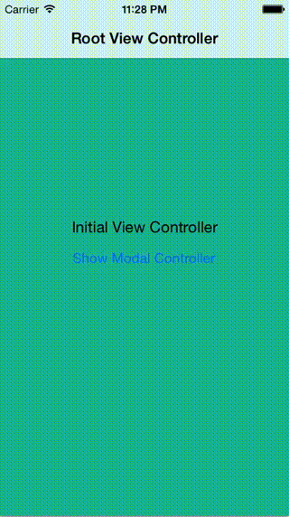

Custom modal transition
=====================



A custom transition I developed for one of my apps. It works on iOS 7 - iOS 8.2.

### UIPresentationController update (iOS 8 only)

A solution using `UIPresentationController` and without iOS 7 hacks can be found in [ios8 branch](https://github.com/pronebird/CustomModalTransition/tree/ios8). It features properly handled appearance events, device orientations support and much less code.

### Cavets

- Controllers will not properly rotate if orientation changed when presented. There is only one exception, if presented controller is a navigation controller, then rotation works fine. This seems to be a UIKit bug on iOS 7 or iOS 8. `UIPresentationController` solves that problem by providing a way to resize controllers on orientation change.
- State restoration is possible but presented VC should restore `transitioningDelegate`, `modalPresentationStyle` and `modalPresentationCapturesStatusBarAppearance`. If you use storyboards then it's easy:

  ```objc
  - (void)encodeRestorableStateWithCoder:(NSCoder *)coder {
    [super encodeRestorableStateWithCoder:coder];
    
    [coder encodeInteger:self.modalPresentationStyle forKey:@"modalPresentationStyle"];
    [coder encodeInteger:self.modalPresentationCapturesStatusBarAppearance forKey:@"modalPresentationCapturesStatusBarAppearance"];
    [coder encodeObject:self.transitioningDelegate forKey:@"transitioningDelegate"];
  }
  
  - (void)decodeRestorableStateWithCoder:(NSCoder *)coder {
    [super decodeRestorableStateWithCoder:coder];
  	
    self.modalPresentationStyle = [coder decodeIntegerForKey:@"modalPresentationStyle"];
    self.modalPresentationCapturesStatusBarAppearance = [coder decodeIntegerForKey:@"modalPresentationCapturesStatusBarAppearance"];
    self.transitioningDelegate = [coder decodeObjectForKey:@"transitioningDelegate"];
  }
  ```

### Blog post

This project is a part of [my blog post](https://coderwall.com/p/njtb0q). However lots of things changed since original blog post was published.

- Unwinding works fine if you fix `segueForUnwindingToViewController` in source navigation controller and create unwind segue using source view controller. Works for both iOS 7 and 8 (see http://stackoverflow.com/a/28607309/351305)
- Resetting views' frames to container bounds before adding them to container helps to solve issues with misplaced navigation bar and rotation issues on iOS 7.
